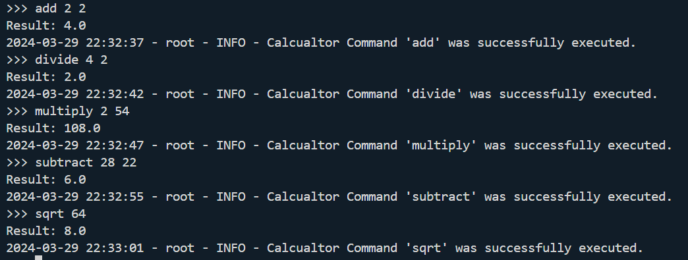
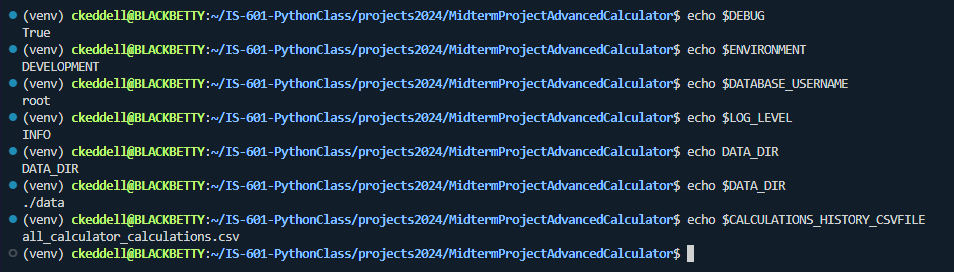
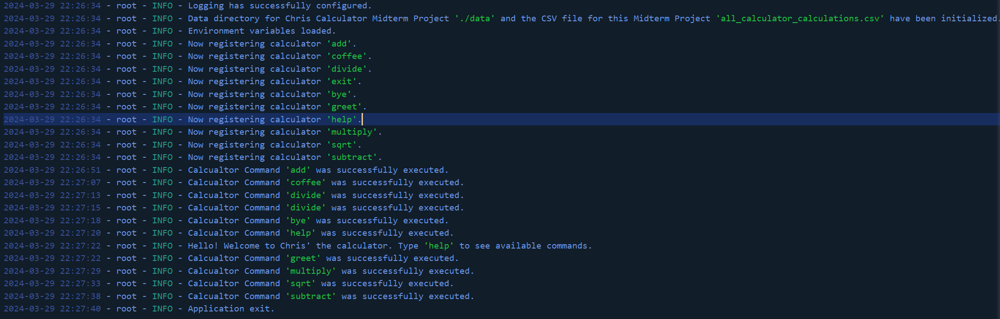

# IS601-Adv-Python-Calc-MIDTERM
Advanced Calculator Project for Midterm in IS601. 

## Demonstrate Calculator Operations - From Simple to some Statistical
1.  Showing that the calculator works as anticipated within the command line for a user.



## Demonstrate History Management with Pandas
More details soon...

## Ensure Environmental Variables are correctly configured 
1.  As seen in image, was able to correctly configure my env variables.



## Using Logging to Record Interactions within Calculator
1. As seen in screenshot below from my app log file, I was able to record interactions a user might have with the calculator.



## Demonstrate Design Patterns
- Command Pattern - All of the commands from greet, multiply, addition, subtraction, divide and the others demonstrate command pattern as they encapsulate a request as an object.
```python
import logging
from app.commands import Command

class GreetCommand(Command):
    def __init__(self):
        super().__init__()
        self.name="greet"
    
    def execute(self):
        logging.info("Hello! Welcome to Chris' the calculator. Type 'help' to see available commands.")
        logging.debug("Greet needs debugging")
        print("Hello! Welcome to Chris' the calculator. Type 'help' to see available commands.")
```
- Factory Method - Including my load_plugins command, as commands are encapsulated in a method that can be determined dynamically.
```python
def load_plugins(self):
        # Assuming this method dynamically loads plugin modules
        plugins_package = 'app.plugins'
        for _, plugin_name, is_pkg in pkgutil.iter_modules([plugins_package.replace('.', '/')]):
            if is_pkg:
                plugin_module = importlib.import_module(f'{plugins_package}.{plugin_name}')
                self.register_plugin_commands(plugin_module)
```

- Facade Pattern - Including my app class here, as this class provides a simplifed interface for a sophisticated subsystem, thus, making the subsystem that much more easy to use.
```python
class App:
    def __init__(self): # Constructor
        os.makedirs('logs', exist_ok=True)
        self.configure_logging()
        ...
        
    def initialize_data_directory(self):
        data_dir = os.getenv('DATA_DIR', './data')
        csv_filename = os.getenv('CALCULATIONS_HISTORY_CSVFILE', 'all_calculator_calculations.csv')
        csv_filepath = os.path.join(data_dir, csv_filename)
        ...
```
- Singleton Pattern - I believe this directly relates to singleton pattern, as this class has only once instance and has global access in the app.
```python
    class ListHandler(logging.Handler):
    """ List Handler
    Handle logging
    """
    def __init__(self):
        super().__init__()
        self.log_records = []

    def emit(self, record):
        self.log_records.append(record)
```

- Strategy Pattern - CommandHandler class here will execute commands, after taking in the user input.
```python
class CommandHandler:
    def execute_command(self, cmd_input):
        # Selects and executes the command (strategy) based on input
```

## LBYL and EAFP
1.  LBYL = "Look Before You Leap"
- With code below, using if and else statements to verify if a command was executed/ran successfully of it ran into an error or the command does not exist.
```python
    def execute_command(self, input_str):
        parts = input_str.split()
        command_name = parts[0]
        args = parts[1:]  # The rest are arguments
        
        command = self._commands.get(command_name)
        if command:
            try:
                command.execute(*args)  # Pass arguments to execute
                logging.info(f"Calcualtor Command '{command_name}' was successfully executed.")
            except Exception as e:
                logging.error(f"Oops, there was an error executing command '{command_name}' : {e}.")
        else:
            logging.error(f"There is no calculator command for this: '{command_name}'.")
```

2. EAFP = "Easier to Ask for Forgiveness than Permission"
- As seen in code below, this test tries to get the WARNING or expected warning from the log handler (except for the AssertionError in this case).
```python
    def test_app_start_exit_command(app):
    app_instance, log_handler = app
    with patch('builtins.input', return_value='exit'), pytest.raises(SystemExit) as exit_exception:
        app_instance.start()

    assert exit_exception.value.code == 0

    # Optional: Check for clean exit logs if your application logs on exit.
    # Ensures no unexpected errors or warnings are logged during shutdown.
    assert not any(record.levelname == 'ERROR' for record in log_handler.log_records), "There are unexpected ERROR logs during exit."
    expected_warning = "The specific warning message you're expecting."
    try:
        assert any(record.levelname == 'WARNING' and expected_warning in record.message for record in log_handler.log_records), "Expected warning message not found."
    except AssertionError:
        pass
```

## Video Walkthrough - 5 Minute (Or Fewer) Video Walkthrough of my Code 
[Midterm](https://youtu.be/v4kBZXJ74lo)